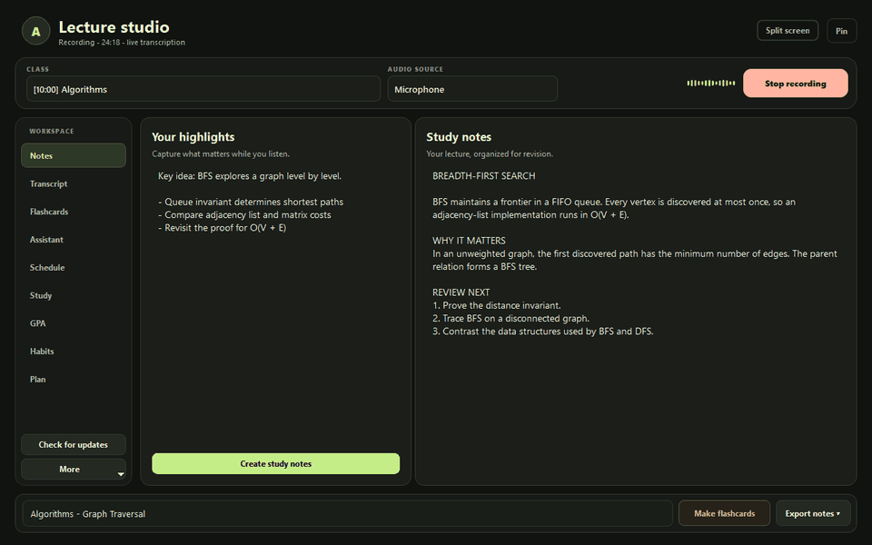
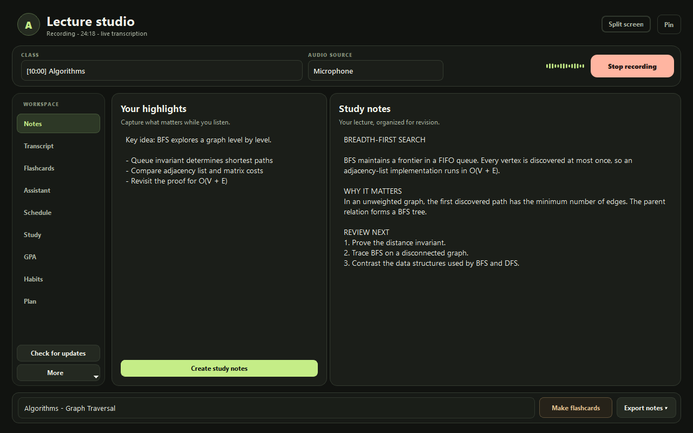
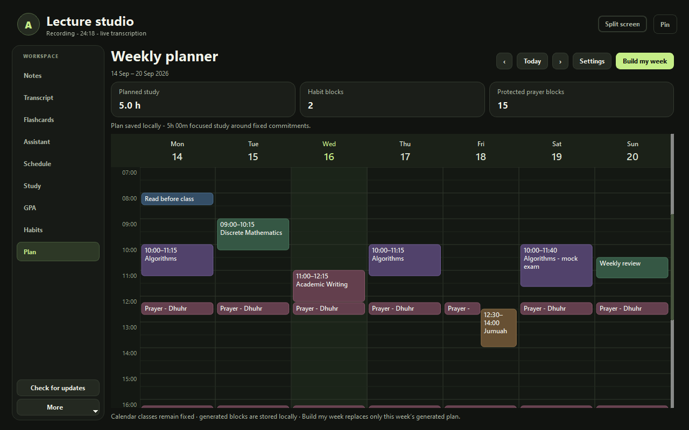
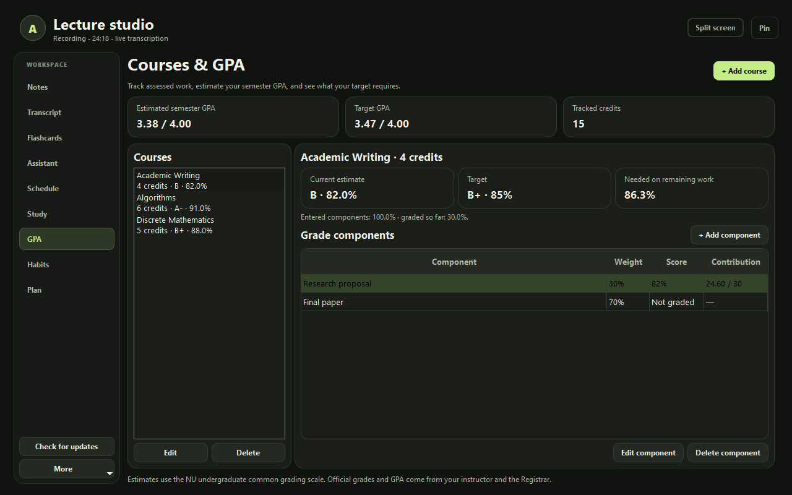
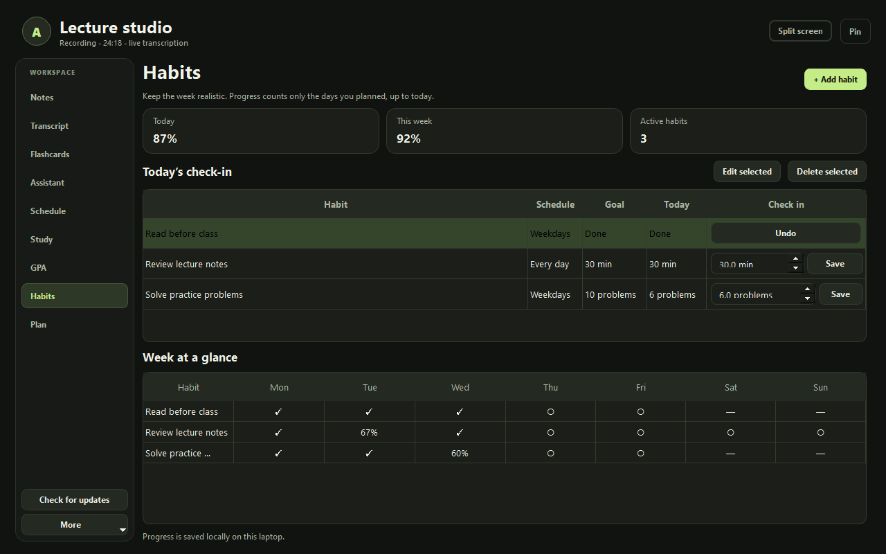
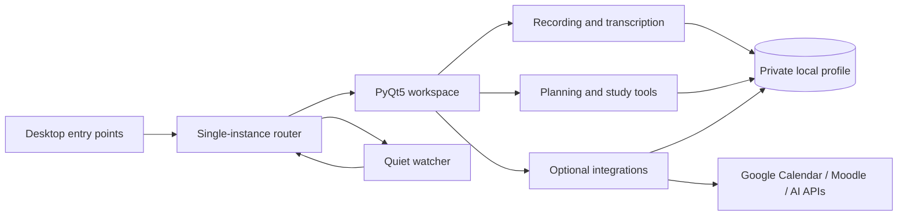

# Lecture Studio

Local-first desktop workspace for turning lectures into an organized study system.

Lecture Studio records and transcribes classes, turns raw material into notes and
flashcards, and keeps planning, grades, habits, deadlines, and focused study time
in one calm desktop app. It is a standalone project: the old voice assistant is
not required or started.

<p align="center">
  
</p>

## What it does

- Records a microphone or supported phone audio source with a live level meter.
- Transcribes locally with `faster-whisper`; AI note generation is optional.
- Combines a transcript, personal highlights, and slide analysis into study notes.
- Creates flashcards and exam-preparation guides from PDF, PPTX, DOCX, and images.
- Shows a Google Calendar-style weekly schedule and tracks focused study sessions.
- Tracks course components, target grades, credit-weighted GPA, and study habits.
- Builds a review-first weekly plan around classes, prayer times, Jumuah, habits,
  grade gaps, and confirmed deadlines.
- Detects Teams, Zoom, and Google Meet sessions from a quiet background watcher.
- Checks GitHub Releases and downloads verified Windows or macOS updates.

<table>
  <tr>
    <td width="50%"><br><sub>Recording and study notes</sub></td>
    <td width="50%"><br><sub>Constraint-aware weekly planner</sub></td>
  </tr>
  <tr>
    <td width="50%"><br><sub>Course and GPA tracker</sub></td>
    <td width="50%"><br><sub>Habit tracker</sub></td>
  </tr>
</table>

All screenshots are generated from a fictional, temporary profile by
[`tools/capture_portfolio.py`](tools/capture_portfolio.py). No personal calendar,
recording, account, or university data is used.

## Privacy by design

Personal data lives outside the repository:

- Windows: `%LOCALAPPDATA%\Annie\LectureStudio`
- macOS: `~/Library/Application Support/Annie/LectureStudio`
- Development override: `ANNIE_DATA_DIR=/absolute/path/outside/the/repository`

Recordings, databases, generated notes, model weights, private Moodle calendar
URLs, API keys, and Google OAuth credentials are ignored by Git and excluded from
release staging. Credentials are protected with Windows DPAPI or macOS Keychain.
Google Calendar, Moodle preview, prayer-time lookup, and optional AI features are
the only network-facing integrations; the core trackers work locally.

Run the repository audit before publishing:

```powershell
python tools/audit_public_repo.py
```

## Install

The simplest installation is a matching package from
[GitHub Releases](https://github.com/narbotonur/LectureStudio/releases).

- Windows: download `LectureStudio-Windows-*.zip`, extract it, and run the app.
- Apple Silicon Mac: download the `arm64` DMG.
- Intel Mac: download the `x86_64` DMG.

macOS builds are currently unsigned and not notarized. Review the release notes
and follow [`packaging/MACOS.md`](packaging/MACOS.md) for Gatekeeper, microphone,
screen-capture, and Keychain permissions. Each user connects their own Google
account and supplies their own credentials; credentials must never be shared.

### Run from source

Windows (Python 3.14):

```powershell
python -m venv .venv
.\.venv\Scripts\python.exe -m pip install -r packaging/requirements-studio.txt
.\run_studio.bat
```

macOS (Python 3.12):

```bash
python3.12 -m venv .venv
source .venv/bin/activate
python -m pip install -r packaging/requirements-macos.txt
python tools/build_macos_audio.py
python lecture_studio_entry.py
```

Useful modes:

```text
python lecture_studio_entry.py                 Open Studio
python lecture_studio_entry.py --watch         Quiet meeting and lecture watcher
python lecture_studio_entry.py --prayer-widget Optional desktop prayer widget
python lecture_studio_entry.py --self-test     Isolated offline diagnostics
```

## Architecture



The application separates UI pages, domain services, OS integrations, and
private profile storage. The watcher routes a detected meeting to the existing
Studio process instead of opening a duplicate window. See
[`docs/ARCHITECTURE.md`](docs/ARCHITECTURE.md) for module boundaries, data flow,
security decisions, and platform-specific code.

## Development and releases

```powershell
python tools/check_studio.py
python tools/capture_portfolio.py
python tools/build_studio_release.py --stage-only
python tools/build_studio_release.py
python tools/build_studio_macos.py --source-only
```

Windows packages are built on Windows. Native macOS bundles and DMGs are built on
macOS through the manual GitHub Actions workflow. Both builders create SHA-256
files used by the in-app updater. Publishing steps are documented in
[`packaging/UPDATES.md`](packaging/UPDATES.md).

The test suite always uses a temporary profile. Do not point tests or demo tools
at an authenticated profile. Before opening a pull request, run the full check and
the public-repository audit.

## Portfolio demo

[`docs/DEMO.md`](docs/DEMO.md) contains a 60-90 second walkthrough, recording
checklist, and a concise project description suitable for a portfolio page.

## Status

Lecture Studio is an actively developed student project. The Windows path is the
most exercised; macOS packaging is tested in CI, while microphone permissions and
hardware behavior still need validation on real Macs. Planning and GPA values are
estimates, not official academic records.
