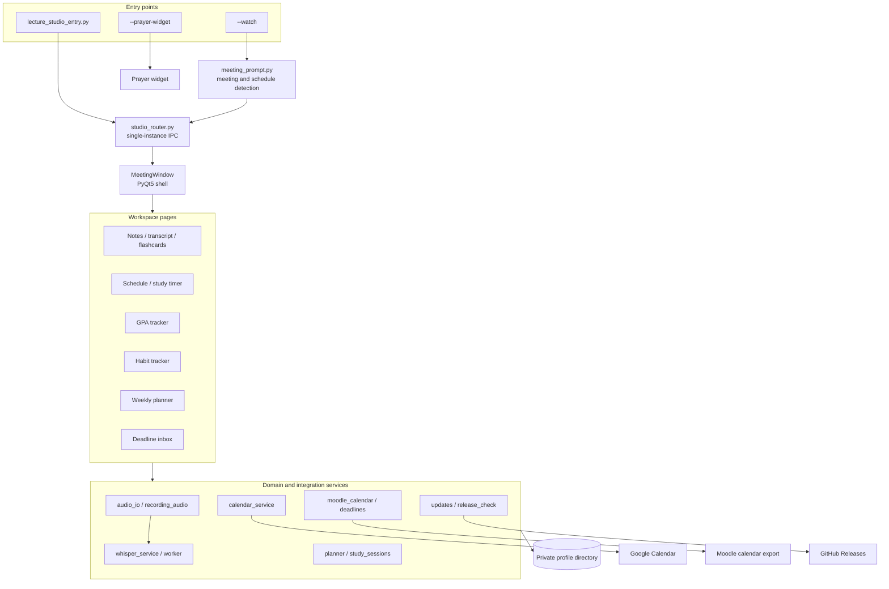
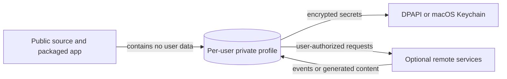

# Architecture

Lecture Studio is a local-first PyQt5 desktop application with small domain
services behind each workspace. Platform-specific behavior is kept at the edges so
the study model can be tested without a microphone, a GUI session, or cloud access.

## System map

## Boundaries

### Entry and process routing

`lecture_studio_entry.py` exposes the normal UI, quiet watcher, prayer widget, and
self-test modes. `annie/studio_router.py` is the single-instance boundary. A
watcher request is delivered to the already-running Studio process; it must not
construct a second `MeetingWindow`.

### Presentation layer

`annie/gui/meeting_window.py` owns the shared shell and navigation. Feature pages
under `annie/gui/` render state and collect user intent, but persistence and
calculation live in domain modules. Long-running transcription, calendar, update,
and generation work uses worker threads so the Qt event loop remains responsive.

### Domain layer

- `gpa_tracker.py` stores courses and assessment components and derives estimates.
- `habits.py` models recurring goals and progress only on scheduled days.
- `planner.py` deterministically places study and habit blocks around fixed events,
  prayer windows, Jumuah, deadlines, and configured daily limits.
- `study_sessions.py` records active-only elapsed time and optional calendar sync.
- `deadlines.py` extracts candidates first; the user reviews them before storage.

These modules accept explicit paths or inputs, which allows isolated unit tests and
the fictional portfolio profile.

### Recording and transcription

Audio capture is selected through `platform_support.py` and implemented by native
or cross-platform helpers. `whisper_service.py` owns model preparation and
`whisper_worker.py` performs transcription away from the UI thread. Model files
remain in the private profile/cache and are never packaged in Git.

### Optional integrations

Google Calendar OAuth, a private Moodle calendar URL, prayer-time lookup, AI note
generation, and GitHub Releases are adapters around the local core. Loss of an
integration should result in a visible, recoverable state rather than corrupting
local trackers. Generated weekly plans are reviewable and do not modify Google
Calendar automatically.

## Data and trust model

The profile directory contains settings, SQLite databases, plans, recordings,
downloads, cached models, and generated study material. Secret values are wrapped
by `secure_storage.py`. Release builders stage an explicit allowlist instead of
copying the working tree, and the audit script rejects credential-shaped values or
private artifact types in tracked files.

## Platform separation

| Concern | Windows | macOS |
| --- | --- | --- |
| Secret storage | DPAPI | Keychain |
| Native audio | Windows capture path | `native/macos` helper |
| Startup | Windows startup integration | LaunchAgent/app integration |
| Update install | Verified ZIP and folder swap | Verified DMG opened for replacement |
| Packaging | Local PyInstaller builder | GitHub Actions on Apple Silicon and Intel |

The domain modules remain platform-neutral. `platform_support.py`,
`macos_support.py`, `macos_audio.py`, startup modules, and packaging scripts contain
the expected OS branches.

## Quality gates

`tools/check_studio.py` runs unit and distribution checks against a temporary
profile. `tools/audit_public_repo.py` inspects tracked files and reachable Git
history without printing secret values. The release builders produce SHA-256
sidecars, and the updater verifies those hashes before presenting installation.
